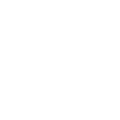

<h1 align="center" class="fs-10">Welcome to Pokitto Guidebook!</h1>

Pokitto Guidebook is a collection of information about Pokitto and how it works.

<h1 align="center">What is Pokitto?</h1>

    
    

        

            POKITTO is a Do-It-Yourself gaming gadget, that you assemble and program yourself.
            With Pokitto, you can learn programming & building electronics in a fun way!
            and you can play exclusive and free games made by our wonderful community
        

        <a href="/pokitto">Read more...</a>
    

<h1 align="center">Getting Started</h1>

    Using the Pokitto for the first time is easy! First you need to start by assembling your Pokitto Follow these steps below to get started with your Pokitto!

    

        
        
<a href="/start/Assembling%20the%20pokitto.html" class="btn mt-5">Assemble Pokitto</a>

    

    

        
        
<a href="/start/play" class="btn mt-5">Download & Play Games</a>

    

    

        
        
<a href="/start/learn" class="btn mt-5">Make your First Games</a>

    

